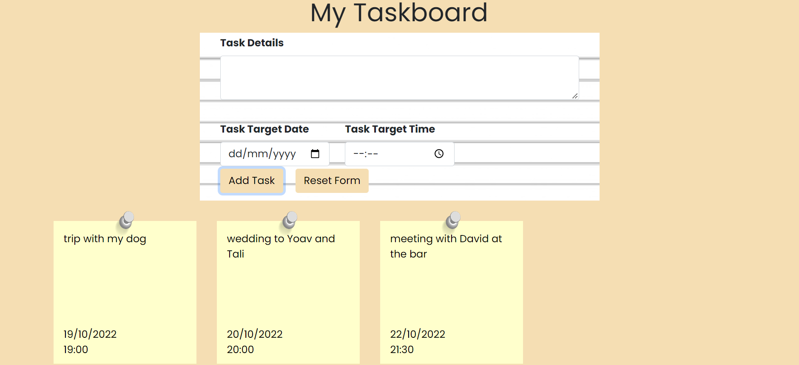

# Taskbar Website

## About The Project:
In my site you can manage your own taskbar.  
For example you can: 
* add new task with description and date.
* remove old tasks thats already finished.

## Images

## Technologies I used:
* JavaScript
* CSS

## Getting Started

### Installing

git clone my reposetory to your local folder.

### Executing program

* Open the index.html file and run it locally on your computer.

## Authors

Ziv Ashkenazi 
[@Linkdin](https://www.linkedin.com/in/ziv-ashkenazi/)